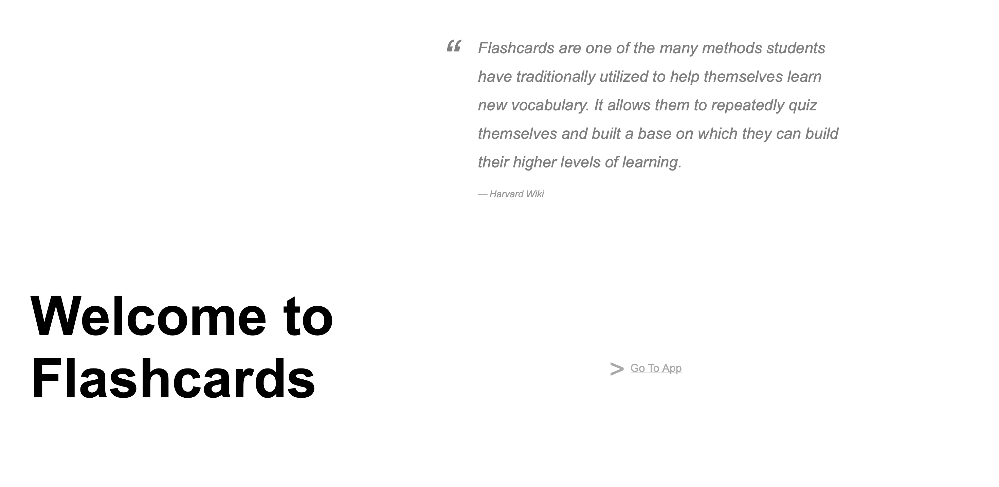
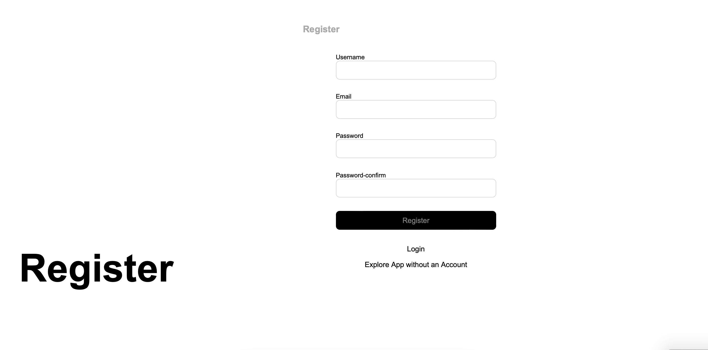
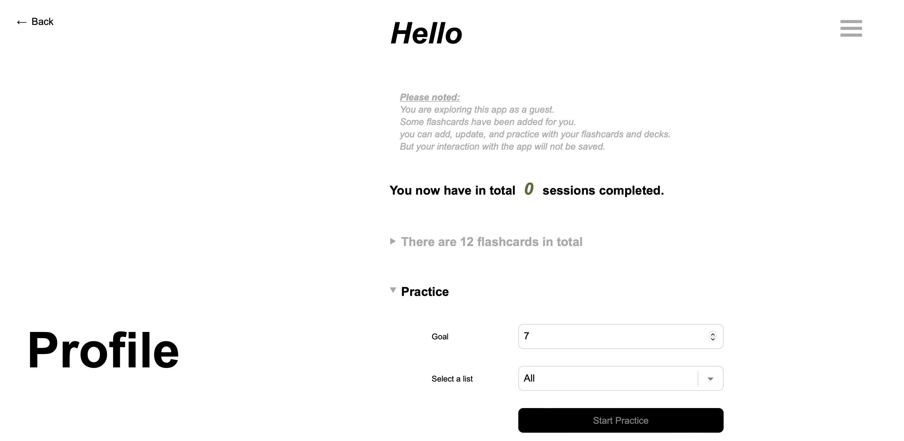
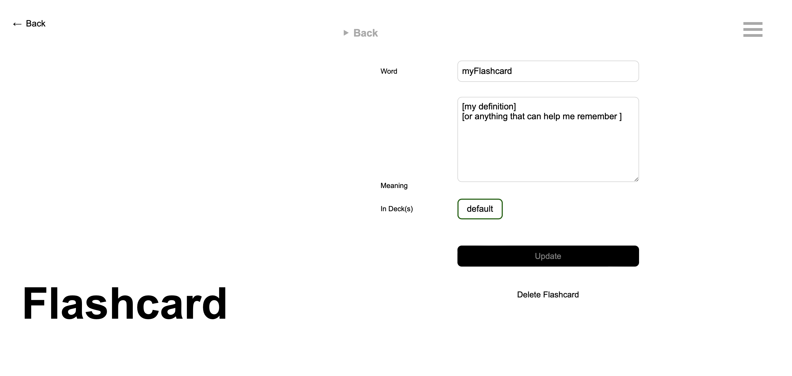
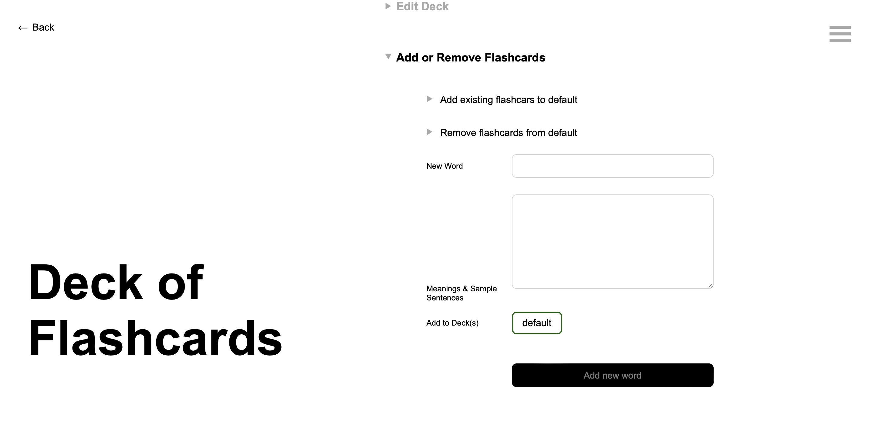
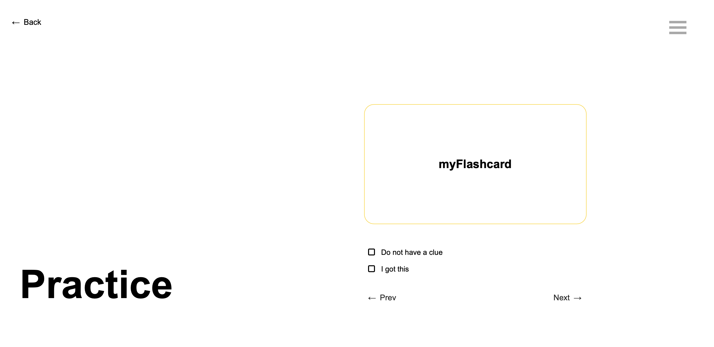
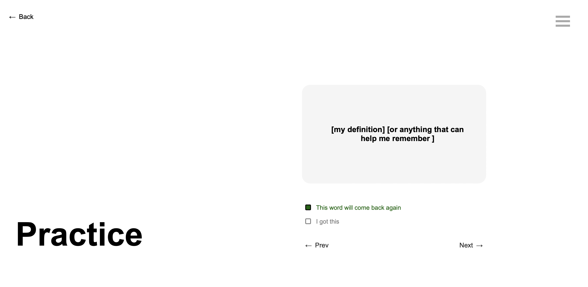
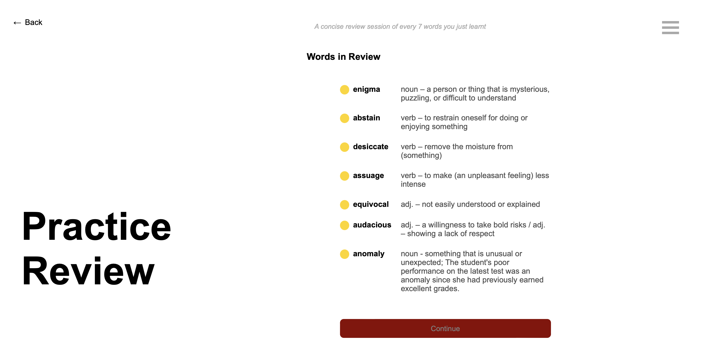

<!-- PROJECT TITLE -->

# Flashcards Web App
<br>


<!-- TABLE OF CONTENTS -->
<details>
  <summary>Table of Contents</summary>
  <ol>
    <li>
      <a href="#about-the-project">About The Project</a>
      <ul>
        <li><a href="#built-with">Built With</a></li>
      </ul>
    </li>
    <li>
      <a href="#getting-started">Getting Started</a>
      <ul>
        <li><a href="#prerequisites">Prerequisites</a></li>
        <li><a href="#installation">Installation</a></li>
      </ul>
    </li>
    <li><a href="#usage">Usage</a></li>
    <li><a href="#roadmap">Roadmap</a></li>
    <li><a href="#contributing">Contributing</a></li>
    <li><a href="#contact">Contact</a></li>
  </ol>
</details>


<!-- ABOUT THE PROJECT -->
## About The Project



Flashcards are one of the many methods students have traditionally utilized to help themselves learn new vocabulary. It allows them to repeatedly quiz themselves and built a base on which they can build their higher levels of learning. There are many great flashcard apps on the market. 

This project is initally intended as an exercise to showcase usage of flask, but later one developed into an app that really suited my needs to maximize the flexibility with adding, editing and sorting flashcards into decks. 

<p align="right">(<a href="#flashcards-web-app">back to top</a>)</p>


### Built With

This section should list any major frameworks/libraries used to bootstrap your project. Leave any add-ons/plugins for the acknowledgements section. Here are a few examples.

* Python3
* Flask
    * flask-session
    * flask-login
    * flask-sqlalchemy
    * wtforms
* HTML5 / CSS

<p align="right">(<a href="#flashcards-web-app">back to top</a>)</p>


<!-- GETTING STARTED -->
## Getting Started

To get a local copy up and running follow these simple example steps.

### Prerequisites

Make sure you have python3 and pip in your local environment.

### Installation

1. Clone the Repo
    ```sh
    git clone https://github.com/W-Du/flashcards.git
    ```
2. Build an environment
    ```sh
    python3 -m venv
    ```
3. Activate bin and install Flask
    ```sh
    source bin/activate
    pip install flask
    ```
4. Run the app
    ```sh
    flask run
    ```
   The terminal shows 
    ```
    * Running on http://127.0.0.1:5000
    ```

<p align="right">(<a href="#flashcards-web-app">back to top</a>)</p>


<!-- USAGE EXAMPLES -->
## Usage

Below is a simple example of users' journey. 



- After app is launched, you will be directed to registration page, where you could choose freely whether to register, login or explore the app as a guest without creating an account. <div style="color: grey">As a guest changes made during the interaction could not be saved, and session will reset at the click of 'reset' button</div>



- Directly in profile page you could practice the flashcards, choose the deck you would like to practice. 
- You could see all saved flashcards. 



- Edit flashcard



- Edit decks




- Pracitce the flashcard will first only show the front side. Click to flip the card to see your notes. 
- Choose 'I remember' or 'I do not remember' to update priority of the flashcard, which helps your learning by keeping inline with your memory curve. 



- Review page after each practice session or after every seven words are practiced will list all words with its priority and its meaning. 
- Priority of words: 
  - green: low - words will not appear in a while as you are very well acquinted with it.
  - yellow: intermediate - words that are just added will have this level of priority. 
  - orange: moderately high - words that you do not remember after a couple of practice sessions or words that did not get reviewed for a long time. 
  - red: high - words that are really difficult for you. 


<p align="right">(<a href="#flashcards-web-app">back to top</a>)</p>


<!-- ROADMAP -->
## Roadmap

- [x] Create database
- [x] Add all basic features 
    - [x] decks: create, edit, delete
    - [x] flashcards: create, edit, delete
- [x] Add practice featuer
    - [x] Choose how many flashcards for the next practice session
    - [x] Update flashcard's priority as user click through the practice
    - [x] Review flashcards noted as 'cannot remember' before practice ended
    - [x] Launch a 'Goal Complete' page 
- [x] Add authentication
- [x] Add bulk edit feature to improve flexibility
    - [x] Duplicate or move multiple flashcards into a different deck at once
    - [x] Delete multiple flashcards at once
- [x] Add a guest route and reflects a registered user without interacting with database
- [ ] Add flask-KVsession to better manage memory for storing session files
- [ ] Add pro-populated decks
    - [ ] Find and query an appropriate api
- [ ] Multi-language Support

<!-- 
See the [open issues](https://github.com/othneildrew/Best-README-Template/issues) for a full list of proposed features (and known issues). -->

<p align="right">(<a href="#flashcards-web-app">back to top</a>)</p>


<!-- CONTRIBUTING -->
## Contributing

Any contributions you make are **greatly appreciated**.

If you have a suggestion that would make this better, please fork the repo and create a pull request. You can also simply open an issue with the tag "enhancement".
Don't forget to give the project a star! Thanks again!

1. Fork the Project
2. Create your Feature Branch (`git checkout -b feature/AmazingFeature`)
3. Commit your Changes (`git commit -m 'Add some AmazingFeature'`)
4. Push to the Branch (`git push origin feature/AmazingFeature`)
5. Open a Pull Request

<p align="right">(<a href="#flashcards-web-app">back to top</a>)</p>


<!-- CONTACT -->
## Contact

W.Du - dwf.0724@gmail.com

Project Link: [https://github.com/W-Du/flashcards](https://github.com/W-Du/flashcards)

<p align="right">(<a href="#flashcards-web-app">back to top</a>)</p>

